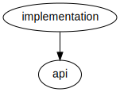
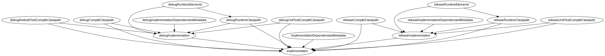
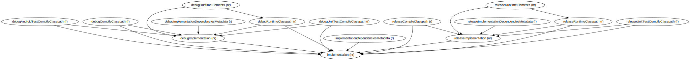

# Gradle Configuration Visualizer

Visualize gradle configurations relation in a graph

- [Gradle Configuration Visualizer](#gradle-configuration-visualizer)
  - [Getting started](#getting-started)
  - [Graph task options](#graph-task-options)
  - [Examples](#examples)
    - [Show me parent Configurations of `implementation` on app module](#show-me-parent-configurations-of-implementation-on-app-module)
    - [Show me all Configurations who extend `implementation` on app module](#show-me-all-configurations-who-extend-implementation-on-app-module)
    - [Show me all Configurations who extend `implementation` on app module and tell me if it can be resolved](#show-me-all-configurations-who-extend-implementation-on-app-module-and-tell-me-if-it-can-be-resolved)
    - [Just dump all configurations on app module](#just-dump-all-configurations-on-app-module)
## Getting started

add this to your gradle project plugin block

```
plugins {
    ...
    id 'dev.rifqimfahmi.gcv.plugin'
}
```

run `visualizeGradleConfig` task to generate entire module configuration graph visualization in an SVG file:

```
./gradlew app:visualizeGradleConfig
```

example output of gradle configurations in an Android module:

visit [this link](https://raw.githubusercontent.com/rifqimfahmi/Gradle-Configuration-Visualizer/main/screenshots/allConfigurations.svg) to enlarge the image.

## Graph task options

```
--reverse           Reverse the graph to find the dependents of specified target
--show-resolved     Show symbol on the node wether the configuration can be resolved or not
--target            Specific config dependency you want to check
```
## Examples
### Show me parent Configurations of `implementation` on app module

```
./gradlew app:visualizeGradleConfig --target implementation
```



### Show me all Configurations who extend `implementation` on app module

```
./gradlew app:visualizeGradleConfig --target implementation --reverse
```



### Show me all Configurations who extend `implementation` on app module and tell me if it can be resolved

```
./gradlew app:visualizeGradleConfig --target implementation --reverse --show-resolved
```



### Just dump all configurations on app module

```
./gradlew app:dumpGradleConfig
```

